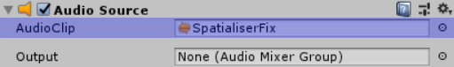
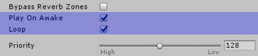
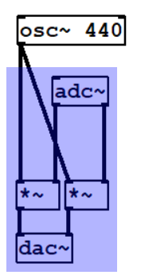

# LibPd Unity Integration

- [About](#about)
- [Unique Features](#unique-features)
- [Quickstart](#quickstart)
- [Spatialisation](#spatialisation)

- [Caveats](#caveats)
- [Future Plans](#future-plans)
- [Credits](#credits)

## About

LibPdIntegration is a wrapper for [libpd](https://github.com/libpd/libpd) developed at [Abertay University](http://www.abertay.ac.uk) for incorporating [Pure Data](https://puredata.info/) patches into [Unity](https://unity3d.com/). It currently supports Windows, OSX, Linux, and iOS (iOS support courtesy [thefuntastic](https://github.com/thefuntastic)).

## Unique Features

LibPdIntegration offers a couple of features which set it apart from existing implementations of libpd for Unity:

- It works with recent versions of Unity (at the time of writing, tested on **2018.4 LTS** and **2019.4 LTS**, though it should work on older versions too).
- It supports multiple instances. This was impossible with previous implementations, as libpd itself did not support running multiple patches side by side. The libpd developers have recently removed that limitation however, meaning LibPdIntegration can allow developers to run multiple Pd patches in their Unity projects. This also means it's now feasible to build a 3D scene in Unity with multiple Pd patches all spatialised using Unity's audio code.

## Quickstart

This repository contains everything you need to incorporate Pd patches into your Unity project. First download it from the [releases](https://github.com/LibPdIntegration/LibPdIntegration/releases) page, then copy the contents of the [Assets](Assets/) folder into your project's Assets folder. LibPdIntegration provides native libpd binaries for supported platforms in the [Plugins](Assets/Plugins/) subfolder, and a single C# script, [LibPdInstance.cs](Assets/Scripts/LibPdInstance.cs) in the [Scripts](Assets/Scripts/) subfolder.

PD patches should be placed in the [StreamingAssets/PdAssets](Assets/StreamingAssets/PdAssets/) folder (you can create your own subfolders within).

To associate a Pd patch with a Unity GameObject, you need to add a single **Lib Pd Instance** Component to the GameObject. Doing this will also add an **Audio Source** Component; this is necessary because Unity does not process audio for GameObjects without an Audio Source.

**Lib Pd Instance** is our wrapper for libpd. To associate a Pd patch with it, drag the patch from your [StreamingAssets/PdAssets](Assets/StreamingAssets/PdAssets/) folder to the **Patch** selector in the Inspector.

Note that the order of Components matters. **Audio Source** must come before **Lib Pd Instance**.

The **Pipe Print To Console** toggle provided by **Lib Pd Instance** lets you pipe any **print** messages sent by your Pd patch to Unity's console for debugging purposes. Note that due to a limitation with libpd, this toggle is global. i.e. if you activate it for one **Lib Pd Instance**, it will be active for all **Lib Pd Instances**.

See the sister project [LibPdIntegrationExamples](https://github.com/LibPdIntegration/LibPdIntegrationExamples) and the [wiki](https://github.com/LibPdIntegration/LibPdIntegration/wiki) for more information, including how to communicate between Unity and libpd.

## Spatialisation

Spatialisation of Pure Data patches in Unity is a little convoluted. The following describes a method that does not require any external frameworks, but do check out the [Spatialisation](https://github.com/LibPdIntegration/LibPdIntegration/wiki/spatialisation) page on the wiki if you happen to be using an external audio framework like [Steam Audio](https://valvesoftware.github.io/steam-audio/). The process is a bit more straightforward in that case.

For this method we need to use a special sound file ([included in this repository](https://github.com/LibPdIntegration/LibPdIntegration/blob/master/extras/SpatialiserFix.wav)) in our **Audio Source**, and use an **`adc~`** object in our PD patch to apply the **Audio Source** spatialisation to the output of our PD patch.

The necessary steps are:

**In Unity:**

1. Set the **Audio Source**'s **AudioClip** to our *SpatialiserFix.wav* sound file.

   

2. Ensure the **Audio Source** is set to **Play On Awake** and **Loop**.

   

3. Set **Spatial Blend** to 1(_3D_).

   

**In Pure Data:**

Multiply the output of your patch with the stereo input from an **`adc~`** object, like the section highlighted in blue here:

This will effectively apply the spatialisation that Unity applies to Audio Sources by default, to the output of our PD patch. For more information, see the [LibPdIntegrationExamples](https://github.com/LibPdIntegration/LibPdIntegrationExamples) project, and particularly the comments in the [_FilteredNoise-ADC.pd_](https://github.com/LibPdIntegration/LibPdIntegrationExamples/blob/master/Assets/StreamingAssets/PdAssets/SpatialisationPatches/FilteredNoise-ADC.pd) patch.

## Caveats

- Only [Pure Data Vanilla](https://puredata.info/downloads/pure-data) is supported. Additional objects (externals) included with distributions like [Purr Data](https://puredata.info/downloads/purr-data) and Pd-Extended (deprecated) do not currently work. See [issue 14](https://github.com/LibPdIntegration/LibPdIntegration/issues/14) for an explanation of why this is; it will hopefully be resolved in a future release.

- Although libpd provides C# bindings, 1.) I could not get them to play nicely with Unity, and 2.) they don't currently support libpd's new multiple instance system. As such, LibPdIntegration interfaces directly with the libpd C library. This may change if libpd's C# bindings get updated in the future, but they should be functionally identical to the C library anyway, so I'm not sure it's necessary.

- **`readsf~`** does not work. This is due to a bug in pure data. At the time of writing there's a [pull request](https://github.com/pure-data/pure-data/pull/1227) that should fix it; once that's been approved I'll try and get new libpd binaries built (anyone who can contribute OSX, Linux and iOS binaries please let me know!).

  In the meantime, you can work around the problem by using **`soundfiler`** instead of **`readsf~`**.

## Future Plans

- Support for more platforms. As libpd itself is provided as a native binary, it needs to be compiled for each platform you plan to deploy to. 
- Expand the example project.
- Gallery of projects using LibPdIntegration?

## Related Projects

- [black and secret places:](https://github.com/NiallMoody/black-and-secret-places) A project where myself ([Niall Moody](http://www.niallmoody.com/)) and [Yann Seznec](https://www.yannseznec.com/) are taking turns streaming the audio implementation using Pure Data and LibPdIntegration. You can view the stream playlist [here](https://www.youtube.com/playlist?list=PL9mtAkCrEZavP0T_C4mLqKdxYD-4wURoZ), and if you want to follow along at home you can download releases for each stream from the [github page](https://github.com/NiallMoody/black-and-secret-places).

## Pure Data Resources

- [Pure Data Main Site](https://puredata.info/)
- [Pure Data Forum](https://forum.pdpatchrepo.info/)
- [Pure Data Manual](http://write.flossmanuals.net/pure-data/introduction2/)
- [Martin Brinkmann's Pd Patches](http://www.martin-brinkmann.de/pd-patches.html)

## Credits

LibPdIntegration is developed by [Niall Moody](http://www.niallmoody.com) at [Abertay University](http://www.abertay.ac.uk), with assistance from [Yann Seznec](http://www.yannseznec.com/). It is licensed under the [MIT License](LICENSE.txt).
