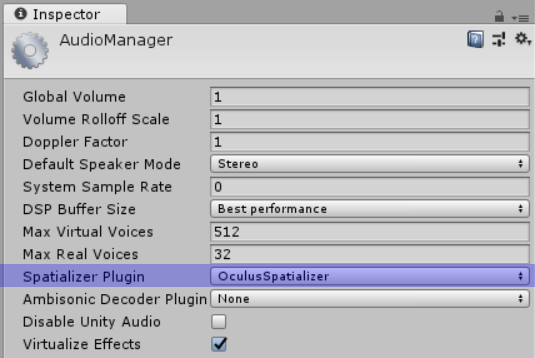
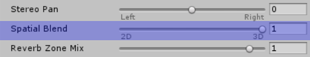
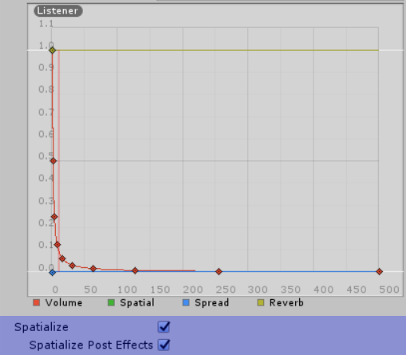

# LibPd Unity Integration

- [About](#about)
- [Unique Features](#unique-features)
- [Quickstart](#quickstart)
- [Spatialisation](#spatialisation)

- [Caveats](#caveats)
- [Future Plans](#future-plans)
- [Credits](#credits)

## About

LibPdIntegration is a wrapper for [libpd](http://libpd.cc/) developed at [Abertay University](http://www.abertay.ac.uk) for incorporating [Pure Data](https://puredata.info/) patches into [Unity](https://unity3d.com/). It currently supports Windows and OSX.

## Unique Features

LibPdIntegration offers a couple of features which set it apart from existing implementations of libpd for Unity:

- It works with recent versions of Unity (at time of writing, tested on 2018.1 and 2018.2).
- It supports multiple instances. This was impossible with previous implementations, as libpd itself did not support running multiple patches side by side. The libpd developers have recently removed that limitation however, meaning LibPdIntegration can allow developers to run multiple PD patches in their Unity projects. This also means it's now feasible to build a 3D scene in Unity with multiple PD patches all spatialised using Unity's audio code.

## Quickstart

This repository contains everything you need to incorporate PD patches into your Unity project. First download it from the [releases](https://github.com/LibPdIntegration/LibPdIntegration/releases) page, then copy the contents of the [Assets](Assets/) folder into your project's Assets folder. LibPdIntegration provides native libpd binaries for supported platforms in the [Plugins](Assets/Plugins/) subfolder, and a single C# script, [LibPdInstance.cs](Assets/Scripts/LibPdInstance.cs) in the [Scripts](Assets/Scripts/) subfolder.

PD patches should be placed in the [StreamingAssets/PdAssets](Assets/StreamingAssets/PdAssets/) folder (you can create your own subfolders within).

To associate a PD patch with a Unity GameObject, you need to add a single **Lib Pd Instance** Component to the GameObject. Doing this will also add an **Audio Source** Component; this is necessary because Unity does not process audio for GameObjects without an Audio Source.

**Lib Pd Instance** is our wrapper for libpd. To associate a PD patch with it, drag the patch from your [StreamingAssets/PdAssets](Assets/StreamingAssets/PdAssets/) folder to the **Patch** selector in the Inspector.

Note that the order of Components matters. **Audio Source** must come before **Lib Pd Instance**.

The **Pipe Print To Console** toggle provided by **Lib Pd Instance** lets you pipe any **print** messages sent by your PD patch to Unity's console for debugging purposes. Note that due to a limitation with libpd, this toggle is global. i.e. if you activate it for one **Lib Pd Instance**, it will be active for all **Lib Pd Instances**.

See the sister project [LibPdIntegrationExamples](https://github.com/LibPdIntegration/LibPdIntegrationExamples) and the [wiki](https://github.com/LibPdIntegration/LibPdIntegration/wiki) for more information, including how to communicate between Unity and libpd.

## Spatialisation

There are a number of different methods for spatialising Pure Data patches in Unity. At the time of writing, the simplest method involves the use of one of Unity's included Spatializer plugins. 

For example, to use the **OculusSpatializer** plugin, you will first need to update your project settings:

1. *Edit -> Project Settings... -> Audio*.
2. Set **Spatializer Plugin** to **OculusSpatializer**.

Then, for each **Audio Source** in your scene, set the **Spatial Blend** slider to 1(_3D_), and toggle the **Spatialize** and **Spatialize Post Effects** options:

For a complete list of spatialisation methods, see the [Spatialisation](https://github.com/LibPdIntegration/LibPdIntegration/wiki/spatialisation) page on the [wiki](https://github.com/LibPdIntegration/LibPdIntegration/wiki).

## Caveats

- Only [Pure Data Vanilla](https://puredata.info/downloads/pure-data) is supported. Additional objects included with distributions like [Purr Data](https://puredata.info/downloads/purr-data) and [Pd-Extended](https://puredata.info/downloads/pd-extended) do not currently work (it's not clear yet whether this is a Unity-specific issue or an bug with LibPdIntegration).
- Although libpd provides C# bindings, 1.) I could not get them to play nicely with Unity, and 2.) they don't currently support libpd's new mutiple instance system. As such, LibPdIntegration interfaces directly with the libpd C library. This may change if libpd's C# bindings get updated in the future, but they should be functionally identical to the C library anyway, so I'm not sure it's necessary.
- In order to get libpd working with Unity, a small [patch](extras/PatchInfo.md) to libpd is necessary ([included in this repository](extras/z_libpd.patch)). The native [Plugins](Assets/Plugins/) in this repository include this patch, but if you want to deploy to other platforms, you'll need to apply the patch yourself.

## Future Plans

- Support for more platforms. As libpd itself is provided as a native binary, it needs to be compiled for each platform you plan to deploy to. This is complicated slightly by the fact that LibPdIntegration requires a [patch](extras/PatchInfo.md) to libpd ([included in this repository](extras/z_libpd.patch)), so any existing libpd binaries found on the internet will not work. The plan is to provide binaries for more platforms as time and resources allow.

- Expand the example project.

- Gallery of projects using LibPdIntegration?

## Pure Data Resources

- [Pure Data Main Site](https://puredata.info/)
- [Pure Data Forum](https://forum.pdpatchrepo.info/)
- [Pure Data Manual](http://write.flossmanuals.net/pure-data/introduction2/)
- [Martin Brinkmann's PD Patches](http://www.martin-brinkmann.de/pd-patches.html)

## Credits

LibPdIntegration is developed by [Niall Moody](http://www.niallmoody.com) at [Abertay University](http://www.abertay.ac.uk), with assistance from [Yann Seznec](http://www.yannseznec.com/). It is licensed under the [MIT License](LICENSE.txt).