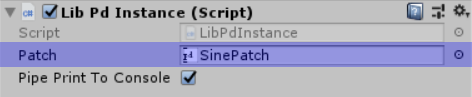

# LibPd Unity Integration

- [About](#about)
- [Unique Features](#unique-features)
- [Quickstart](#quickstart)
- [Spatialisation](#spatialisation)

  - [An Alternative Approach to Spatialisation](#an-alternative-approach-to-spatialisation)
- [Caveats](#caveats)
- [Future Plans](#future-plans)
- [Credits](#credits)

## About

LibPdIntegration is a wrapper for [libpd](http://libpd.cc/) developed at [Abertay University](http://www.abertay.ac.uk), for incorporating [Pure Data](https://puredata.info/) patches into [Unity](https://unity3d.com/). It currently supports Windows and OSX.

## Unique Features

LibPdIntegration offers a couple of features which set it apart from existing implementations of libpd for Unity:

- It works with recent versions of Unity (at time of writing, tested on 2018.1 and 2018.2).
- It supports multiple instances. This was impossible with previous implementations, as libpd itself did not support running multiple patches side by side. The libpd developers have recently removed that limitation however, meaning LibPdIntegration can allow developers to run multiple PD patches in their Unity projects. This also means it's now feasible to build a 3D scene in Unity with multiple PD patches all spatialised using Unity's audio code.

## Quickstart

This repository contains everything you need to incorporate PD patches into your Unity project. Simply copy the contents of the [Assets](Assets/) folder into your project's Assets folder. LibPdIntegration provides native libpd binaries for supported platforms in the [Plugins](Assets/Plugins/) subfolder, and a single C# script, [LibPdInstance.cs](Assets/Scripts/LibPdInstance.cs) in the [Scripts](Assets/Scripts/) subfolder.

PD patches should be placed in the [StreamingAssets/PdAssets](Assets/StreamingAssets/PdAssets/) folder (you can create your own subfolders within).

To associate a PD patch with a Unity GameObject, you'll need to add 2 Components to the GameObject:

1. **Audio Source:** This is necessary because Unity does not process audio for GameObjects without an Audio Source.

2. **Lib Pd Instance:** Our wrapper for libpd. To associate a PD patch with it, drag the patch from your [StreamingAssets/PdAssets](Assets/StreamingAssets/PdAssets/) folder to the **Patch** selector in the Inspector.

Note that the order matters. **Audio Source** must come before **Lib Pd Instance**.

The **Pipe Print To Console** toggle provided by **Lib Pd Instance** lets you pipe any **print** messages sent by your PD patch to Unity's console for debugging purposes. Note that due to a limitation with libpd, this toggle is global. i.e. if you activate it for one **Lib Pd Instance**, it will be active for all **Lib Pd Instances**.

See the sister project [LibPdIntegrationExamples](https://github.com/LibPdIntegration/LibPdIntegrationExamples) and the comments in [LibPdInstance.cs](Assets/Scripts/LibPdInstance.cs) for more information, including how to communicate between Unity and libpd.

## Spatialisation

Due to the way Unity spatialises sound, spatialising a PD patch in Unity is a slightly involved process.

The first thing to note is that, by default, Unity only spatialises **Audio Sources**. It won't apply spatialisation to any other audio producing Components (like **Lib Pd Instance**). In order to get around that limitation, we need to cheat the system a bit.

After adding an **Audio Source** and **Lib Pd Instance** to a GameObject in your scene, the steps you'll need to take to spatialise your PD patch are:

1. Set the **Audio Source's** **AudioClip** to the [SpatialiserFix.wav](extras/SpatialiserFix.wav) file included in this repository. This is a short file containing a constant dc value of +1, so it should not be played through speakers. We're using it solely to send a signal to our PD patch. See [FilteredNoise.pd](https://github.com/LibPdIntegration/LibPdIntegrationExamples/Assets/StreamingAssets/PdAssets/SpatialisationPatches) in [LibPdIntegrationExamples](https://github.com/LibPdIntegration/LibPdIntegrationExamples) for a detailed explanation.

2. Set the **Audio Source** to **Play On Awake** and **Loop**.

3. Adjust the **Spatial Blend** slider to **1 (3D)**.

4. In your PD patch, multiply the 2 outputs of an **adc~** object by the output of your patch before feeding it to the **dac~** object.

This process will ensure that any spatialisation applied to the AudioSource gets applied to the output of your patch.

### An Alternative Approach to Spatialisation

An alternative, less-involved approach is to use Unity's **OculusSpatializer** plugin. When I tested it, this seemed to apply some odd filtering to the sound, but you may prefer this approach.

To use the **OculusSpatializer** plugin, the steps are:

1. *Edit -> Project Settings... -> Audio*.
2. Set **Spatializer Plugin** to **OculusSpatializer**.

This will spatialise all audio for you, without any need for the aforementioned [SpatialiserFix.wav](extras/SpatialiserFix.wav) file and **adc~** object in each patch.

## Caveats

- Although libpd provides C# bindings, 1.) I could not get them to play nicely with Unity, and 2.) they don't currently support libpd's new mutiple instance system. As such, LibPdIntegration interfaces directly with the libpd C library. This may change if libpd's C# bindings get updated in the future, but they should be functionally identical to the C library anyway, so I'm not sure it's necessary.
- In order to get libpd working with Unity, a small [patch](extras/PatchInfo.md) to libpd is necessary ([included in this repository](extras/z_libpd.patch)). The native [Plugins](Assets/Plugins/) in this repository include this patch, but if you want to deploy to other platforms, you'll need to apply the patch yourself.

## Future Plans

- Properly formatted reference documentation, generated from [LibPdInstance.cs](Assets/Scripts/LibPdInstance.cs).
- Support for more platforms. As libpd itself is provided as a native binary, it needs to be compiled for each platform you plan to deploy to. This is complicated slightly by the fact that LibPdIntegration requires a [patch](extras/PatchInfo.md) to libpd ([included in this repository](extras/z_libpd.patch)), so any existing libpd binaries found on the internet will not work. The plan is to provide binaries for more platforms as time and resources allow.
- Expand the example project.
- Gallery of projects using LibPdIntegration?

## Credits

LibPdIntegration is developed by [Niall Moody](http://www.niallmoody.com) at [Abertay University](http://www.abertay.ac.uk), with assistance from [Yann Seznec](http://www.yannseznec.com/). It is licensed under the [MIT License](LICENSE.txt).